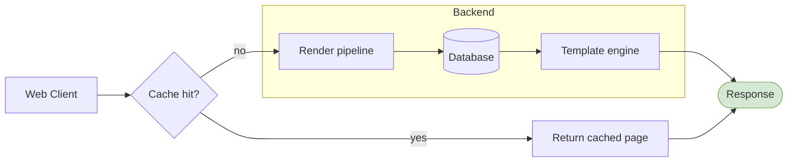
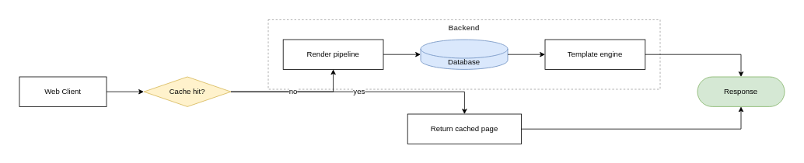
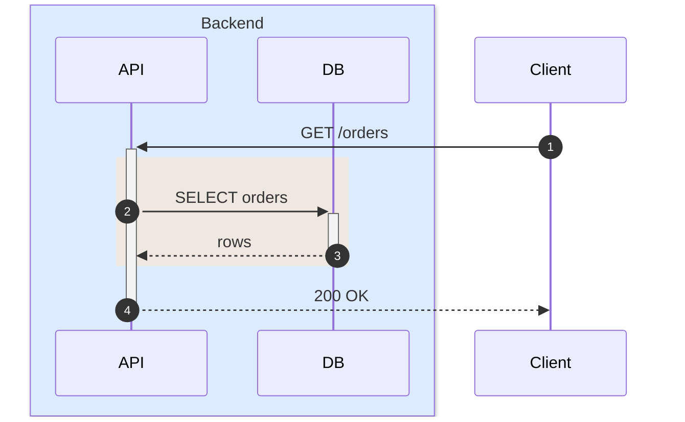
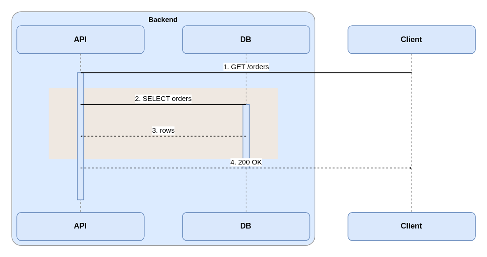
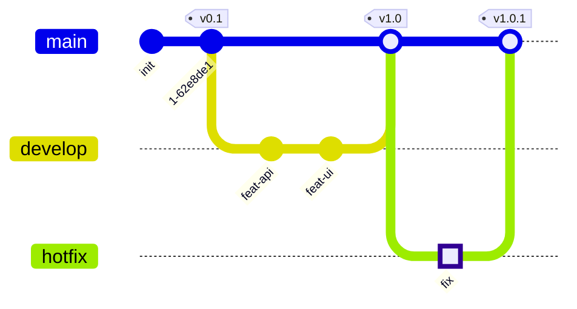
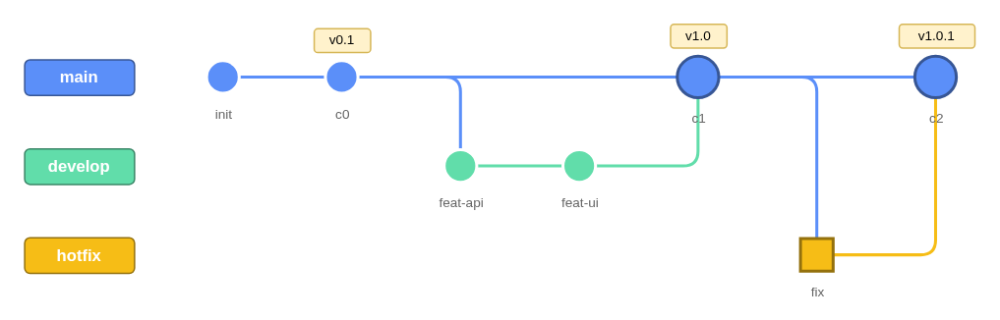

# mermaid-to-drawio

*[English version → README.md](README.md)*

[Mermaid](https://mermaid.js.org/) の図を、画像埋め込みではなく **編集可能なネイティブ図形**として [draw.io](https://www.drawio.com/) (`.drawio`) ファイルに変換するツールです。

```
flowchart LR                    ┌────────┐      ┌─────────┐
  A[Mermaid で書く] --> B       │Mermaid │ ───> │draw.io  │     …変換後も全ノードが
  B[draw.io で仕上げる]         │で書く  │      │で仕上げ │     動かせて、色も線も
                                └────────┘      └─────────┘     つなぎ替えも自由。
```

## なぜ作ったか

図を*書く*なら Mermaid が最速、図を*磨く*なら draw.io が最強です。しかし Mermaid を SVG/PNG に書き出すと、それはもう編集できない「絵」になってしまいます。このツールは Mermaid のソースを直接パースして **draw.io ネイティブ図形 (`mxCell`)** を出力するので、変換後もすべてのノード・エッジ・ラベルが編集可能なままです。生成ファイルは Gliffy や Lucidchart にもそのままインポートできます。

意図的に軽量な作りで、ネイティブ変換はレイアウト用の [dagre](https://github.com/dagrejs/dagre) だけに依存します(`node_modules` 約 2MB、ブラウザ・puppeteer 不要)。

## 変換例

以下の各ペアは「Mermaid ソース(GitHub がレンダリング)」と「変換した .drawio を draw.io で開いた実画面」です。すべてのノードが移動・再スタイル・つなぎ替え可能な実シェイプになっています。

**フローチャート** — サブグラフ、ノード形状、エッジラベル、`style` ディレクティブ:





**シーケンス図** — 参加者の `box` グループ、`rect` ハイライト、活性化バー、`autonumber`:





**Git グラフ** — ブランチ、マージ、タグ、強調コミット:





## 対応図式

**19 種の Mermaid 図式をネイティブ変換:**

flowchart / graph · erDiagram · sequenceDiagram · stateDiagram(-v2) · classDiagram · pie · gantt · mindmap · journey · timeline · quadrantChart · kanban · packet · xychart · radar · sankey · gitGraph · requirementDiagram · C4 (Context / Container / Component / Dynamic / Deployment)

残りの数種(`block-beta`、`architecture-beta`、`zenuml`)はオプションの png/svg 画像埋め込みモードで変換できます。対応図式内の未対応構文は警告を出してスキップし、変換は継続します(graceful degradation)。日本語などの CJK ラベルは全図式で使えます。

図式ごとの詳細な構文カバレッジは [tool/README.ja.md](tool/README.ja.md) を参照してください。

## クイックスタート (CLI)

Node.js ≥ 18 が必要です。最速は npx:

```bash
npx mermaid2drawio diagram.mmd     # → diagram.drawio
```

またはソースから:

```bash
git clone https://github.com/mmzz164/mermaid-to-drawio.git
cd mermaid-to-drawio/tool
npm install --omit=optional        # ネイティブモードのみ: 約 2MB、puppeteer 不要

# 単一の図 → diagram.drawio
node src/cli.js diagram.mmd

# Markdown 文書: ```mermaid フェンスごとに 1 ページ、
# ページ名は直前の Markdown 見出しから自動命名
node src/cli.js design-doc.md -o design-doc.drawio

# 複数入力を 1 つの複数ページファイルに / XML を標準出力へ
node src/cli.js flow.mmd er.mmd notes.md -o all.drawio
node src/cli.js diagram.mmd -o -
```

生成物は [app.diagrams.net](https://app.diagrams.net/) や draw.io デスクトップアプリで開けるほか、Gliffy / Lucidchart にもインポートできます。

png/svg 画像埋め込みモード(非対応 3 図式にのみ必要)を使う場合はオプション依存を追加します:

```bash
npm install --include=optional
npx puppeteer browsers install chrome-headless-shell
```

## Claude Code スキルとして使う

このリポジトリは [Claude Code](https://code.claude.com/docs/) のスキルを兼ねています。`SKILL.md` が変換ツールの使い方を Claude に教えるので、「この mermaid を drawio にして」と頼んだり、Markdown の設計文書を渡して複数ページの `.drawio` を受け取ったりできます。

```bash
git clone https://github.com/mmzz164/mermaid-to-drawio.git ~/.claude/skills/mermaid-to-drawio
cd ~/.claude/skills/mermaid-to-drawio/tool && npm install --omit=optional
```

Claude Code はスキルを自動認識します。`/mermaid-to-drawio` で明示的に呼び出すことも可能です。

## リポジトリ構成

| パス | 内容 |
| --- | --- |
| `tool/` | 変換ツール本体: CLI (`src/cli.js`)、ライブラリ (`src/index.js`)、図式ごとのパーサ + レンダラ |
| `tool/README.md` | CLI / ライブラリの詳細ドキュメント(英語) |
| `tool/README.ja.md` | 同ドキュメントの日本語版 |
| `tool/test/` | テスト 188 件。全図式の出力をバイト単位で固定するゴールデンスナップショットを含む |
| `SKILL.md` | Claude Code スキル定義(日本語) |

## 信頼性

- **ゴールデンスナップショットテスト**: 図式ごとに入力と期待出力をコミットしており(`tool/test/fixtures/golden/`)、生成出力が 1 バイトでも変われば `npm test` が失敗します。意図的な変更は `npm run golden:update` で更新します。
- **実行時 XML ガード**: CLI は書き出し前に生成 XML を検査(エスケープ・クオート)するため、draw.io が開けないファイルを作ることがありません。
- 出力は決定的 — 同じ入力からは常に同じバイト列が生成されます(タイムスタンプ・乱数なし)。

## ライセンス

MIT
